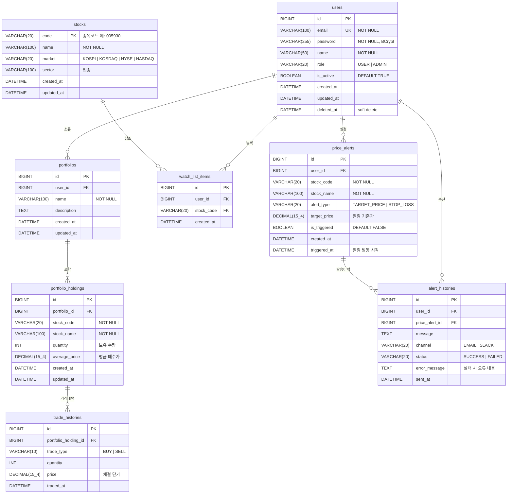

# ERD — 주식 포트폴리오 관리 서비스

## 도메인 모델 개요

| 테이블 | 설명 |
|--------|------|
| `users` | 서비스 회원 |
| `portfolios` | 사용자가 만든 포트폴리오 |
| `portfolio_holdings` | 포트폴리오에 담긴 보유 종목 |
| `trade_histories` | 매수/매도 거래 내역 |
| `stocks` | 종목 기본 정보 (시세는 Redis) |
| `watch_list_items` | 관심종목 |
| `price_alerts` | 가격 알림 설정 (목표가/손절가) |
| `alert_histories` | 알림 발송 이력 |

---

## ERD 다이어그램 (Mermaid)



---

## DDL (MySQL 8.x)

```sql
-- ==============================
-- users
-- ==============================
CREATE TABLE users (
    id          BIGINT          NOT NULL AUTO_INCREMENT,
    email       VARCHAR(100)    NOT NULL,
    password    VARCHAR(255)    NOT NULL COMMENT 'BCrypt 해시',
    name        VARCHAR(50)     NOT NULL,
    role        VARCHAR(20)     NOT NULL DEFAULT 'USER' COMMENT 'USER | ADMIN',
    is_active   BOOLEAN         NOT NULL DEFAULT TRUE,
    created_at  DATETIME        NOT NULL DEFAULT CURRENT_TIMESTAMP,
    updated_at  DATETIME        NOT NULL DEFAULT CURRENT_TIMESTAMP ON UPDATE CURRENT_TIMESTAMP,
    deleted_at  DATETIME        NULL COMMENT 'Soft delete',
    PRIMARY KEY (id),
    UNIQUE KEY uq_users_email (email)
) ENGINE=InnoDB DEFAULT CHARSET=utf8mb4 COLLATE=utf8mb4_unicode_ci;

-- ==============================
-- stocks
-- ==============================
CREATE TABLE stocks (
    code        VARCHAR(20)     NOT NULL COMMENT '종목코드 (예: 005930)',
    name        VARCHAR(100)    NOT NULL COMMENT '종목명',
    market      VARCHAR(20)     NOT NULL COMMENT 'KOSPI | KOSDAQ | NYSE | NASDAQ',
    sector      VARCHAR(100)    NULL COMMENT '업종',
    created_at  DATETIME        NOT NULL DEFAULT CURRENT_TIMESTAMP,
    updated_at  DATETIME        NOT NULL DEFAULT CURRENT_TIMESTAMP ON UPDATE CURRENT_TIMESTAMP,
    PRIMARY KEY (code)
) ENGINE=InnoDB DEFAULT CHARSET=utf8mb4 COLLATE=utf8mb4_unicode_ci;

-- ==============================
-- portfolios
-- ==============================
CREATE TABLE portfolios (
    id          BIGINT          NOT NULL AUTO_INCREMENT,
    user_id     BIGINT          NOT NULL,
    name        VARCHAR(100)    NOT NULL,
    description TEXT            NULL,
    created_at  DATETIME        NOT NULL DEFAULT CURRENT_TIMESTAMP,
    updated_at  DATETIME        NOT NULL DEFAULT CURRENT_TIMESTAMP ON UPDATE CURRENT_TIMESTAMP,
    PRIMARY KEY (id),
    CONSTRAINT fk_portfolios_user FOREIGN KEY (user_id) REFERENCES users (id)
) ENGINE=InnoDB DEFAULT CHARSET=utf8mb4 COLLATE=utf8mb4_unicode_ci;

-- ==============================
-- portfolio_holdings
-- ==============================
CREATE TABLE portfolio_holdings (
    id              BIGINT          NOT NULL AUTO_INCREMENT,
    portfolio_id    BIGINT          NOT NULL,
    stock_code      VARCHAR(20)     NOT NULL,
    stock_name      VARCHAR(100)    NOT NULL,
    quantity        INT             NOT NULL DEFAULT 0 COMMENT '보유 수량',
    average_price   DECIMAL(15, 4)  NOT NULL COMMENT '평균 매수가',
    created_at      DATETIME        NOT NULL DEFAULT CURRENT_TIMESTAMP,
    updated_at      DATETIME        NOT NULL DEFAULT CURRENT_TIMESTAMP ON UPDATE CURRENT_TIMESTAMP,
    PRIMARY KEY (id),
    CONSTRAINT fk_holdings_portfolio FOREIGN KEY (portfolio_id) REFERENCES portfolios (id),
    UNIQUE KEY uq_holding_portfolio_stock (portfolio_id, stock_code)
) ENGINE=InnoDB DEFAULT CHARSET=utf8mb4 COLLATE=utf8mb4_unicode_ci;

-- ==============================
-- trade_histories
-- ==============================
CREATE TABLE trade_histories (
    id                      BIGINT          NOT NULL AUTO_INCREMENT,
    portfolio_holding_id    BIGINT          NOT NULL,
    trade_type              VARCHAR(10)     NOT NULL COMMENT 'BUY | SELL',
    quantity                INT             NOT NULL,
    price                   DECIMAL(15, 4)  NOT NULL COMMENT '체결 단가',
    traded_at               DATETIME        NOT NULL DEFAULT CURRENT_TIMESTAMP,
    PRIMARY KEY (id),
    CONSTRAINT fk_trade_holding FOREIGN KEY (portfolio_holding_id) REFERENCES portfolio_holdings (id),
    INDEX idx_trade_traded_at (traded_at)
) ENGINE=InnoDB DEFAULT CHARSET=utf8mb4 COLLATE=utf8mb4_unicode_ci;

-- ==============================
-- watch_list_items
-- ==============================
CREATE TABLE watch_list_items (
    id          BIGINT      NOT NULL AUTO_INCREMENT,
    user_id     BIGINT      NOT NULL,
    stock_code  VARCHAR(20) NOT NULL,
    created_at  DATETIME    NOT NULL DEFAULT CURRENT_TIMESTAMP,
    PRIMARY KEY (id),
    CONSTRAINT fk_watchlist_user  FOREIGN KEY (user_id)    REFERENCES users (id),
    CONSTRAINT fk_watchlist_stock FOREIGN KEY (stock_code) REFERENCES stocks (code),
    UNIQUE KEY uq_watchlist_user_stock (user_id, stock_code)
) ENGINE=InnoDB DEFAULT CHARSET=utf8mb4 COLLATE=utf8mb4_unicode_ci;

-- ==============================
-- price_alerts
-- ==============================
CREATE TABLE price_alerts (
    id              BIGINT          NOT NULL AUTO_INCREMENT,
    user_id         BIGINT          NOT NULL,
    stock_code      VARCHAR(20)     NOT NULL,
    stock_name      VARCHAR(100)    NOT NULL,
    alert_type      VARCHAR(20)     NOT NULL COMMENT 'TARGET_PRICE | STOP_LOSS',
    target_price    DECIMAL(15, 4)  NOT NULL,
    is_triggered    BOOLEAN         NOT NULL DEFAULT FALSE,
    created_at      DATETIME        NOT NULL DEFAULT CURRENT_TIMESTAMP,
    triggered_at    DATETIME        NULL,
    PRIMARY KEY (id),
    CONSTRAINT fk_alerts_user FOREIGN KEY (user_id) REFERENCES users (id),
    INDEX idx_alert_stock_triggered (stock_code, is_triggered)
) ENGINE=InnoDB DEFAULT CHARSET=utf8mb4 COLLATE=utf8mb4_unicode_ci;

-- ==============================
-- alert_histories
-- ==============================
CREATE TABLE alert_histories (
    id              BIGINT      NOT NULL AUTO_INCREMENT,
    user_id         BIGINT      NOT NULL,
    price_alert_id  BIGINT      NOT NULL,
    message         TEXT        NOT NULL,
    channel         VARCHAR(20) NOT NULL COMMENT 'EMAIL | SLACK',
    status          VARCHAR(20) NOT NULL COMMENT 'SUCCESS | FAILED',
    error_message   TEXT        NULL,
    sent_at         DATETIME    NOT NULL DEFAULT CURRENT_TIMESTAMP,
    PRIMARY KEY (id),
    CONSTRAINT fk_alert_hist_user  FOREIGN KEY (user_id)        REFERENCES users (id),
    CONSTRAINT fk_alert_hist_alert FOREIGN KEY (price_alert_id) REFERENCES price_alerts (id),
    INDEX idx_alert_hist_sent_at (sent_at)
) ENGINE=InnoDB DEFAULT CHARSET=utf8mb4 COLLATE=utf8mb4_unicode_ci;
```

---

## 설계 포인트 & 의사결정

### 시세 데이터를 DB에 저장하지 않는 이유
실시간 주가는 변동 주기가 매우 짧아 DB에 저장하면 쓰기 부하가 과도해짐.
→ Redis에 `stock:price:{code}` 키로 캐싱, TTL 30초 적용.
외부 API는 캐시 미스 시에만 호출 (Cache-Aside 패턴).

### stock_name을 holding/alert에 반정규화한 이유
종목명은 변경될 수 있고, 이력 데이터는 당시 시점의 이름을 보존해야 함.
JOIN 비용 절감 + 이력 정합성 확보를 위해 의도적 반정규화.

### Soft Delete (deleted_at)
users 테이블만 적용. 거래 이력, 알림 이력 등은 법적/감사 목적으로 물리 삭제 금지.

### 인덱스 전략
- `price_alerts (stock_code, is_triggered)`: 알림 스케줄러가 미발동 알림을 stock_code 기준으로 조회하는 패턴 최적화
- `trade_histories (traded_at)`: 기간별 거래 내역 조회 최적화
- `alert_histories (sent_at)`: 관리자 페이지 최근 발송 이력 조회 최적화

### average_price 계산 방식
매수 시: `(기존 평균가 × 기존 수량 + 신규 단가 × 신규 수량) / (기존 수량 + 신규 수량)`
매도 시: 수량만 차감, 평균가 유지 (FIFO는 추후 확장 기능으로)
